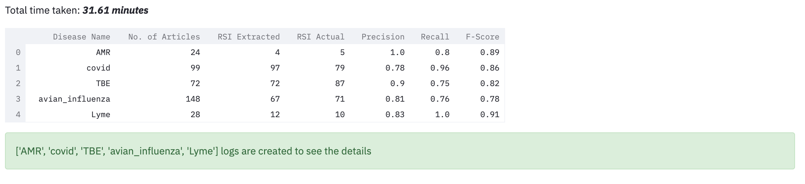

# Relative Spatial Information (RSI) Dataset


## Diseases News Articles Data
We utilize the infectious diseases news articles data for the year '2020'. The data in each CSV file are manually labelled having extracted Relative Spatial Information (RSI) in **rsi** column. The dataset contains the data of the following diseases: 

1. Antimicrobial resistance (AMR) 
2. COVID-19
3. Avian-Influenza
4. Lyme
5. Tick-borne Encephalitis (TBE)


## Configuration

1. You should have logs folder in your **root** directory of application.
2. The logs folder must be empty before running the application.

## Installation
There are few Python packages that are needed to install before running application

1. Install spacy for natural language processing (NLP) tasks 
```sh
pip install spacy
```
2. Install gensim library for data preprocessing
```sh
pip install gensim
```
3. Install streamit library for running GeoX web application 
```sh
pip install streamlit
```
4. Install spacy-streamlit for display named entities (RSI) in the text 
```sh
pip install spacy-streamlit
```

## How to run the application

```sh
streamlit run App.py
```

## Example Output Run

Here is the example output run that calculate the precision, recall and F-score for each disease CSV file





## Logs of Evaluation

The output logs are records for each disease csv file

**Example:** The log details for **articles_AMR_2020.csv** is saved as **logs/AMR.txt** file. A quick view of the **logs/AMR.txt** log file is as follows:

